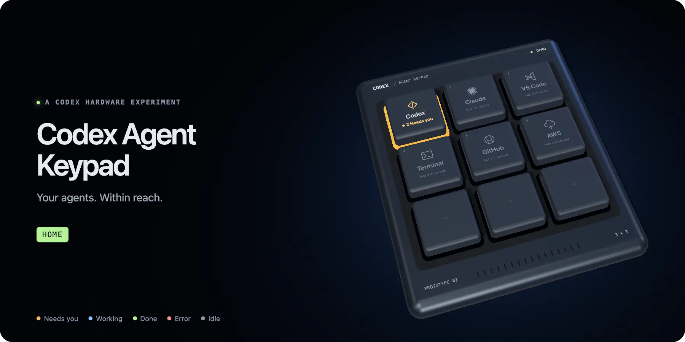
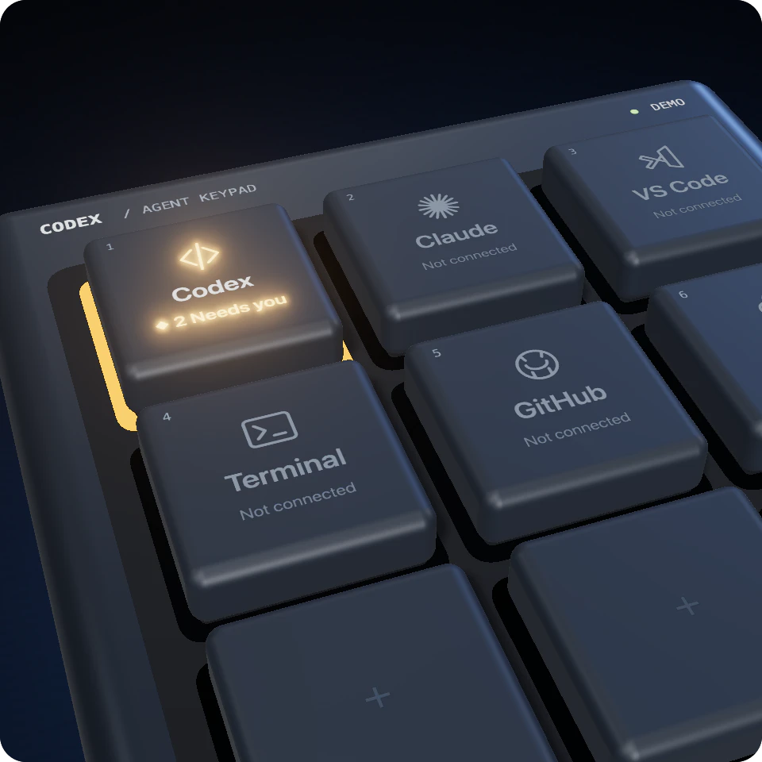
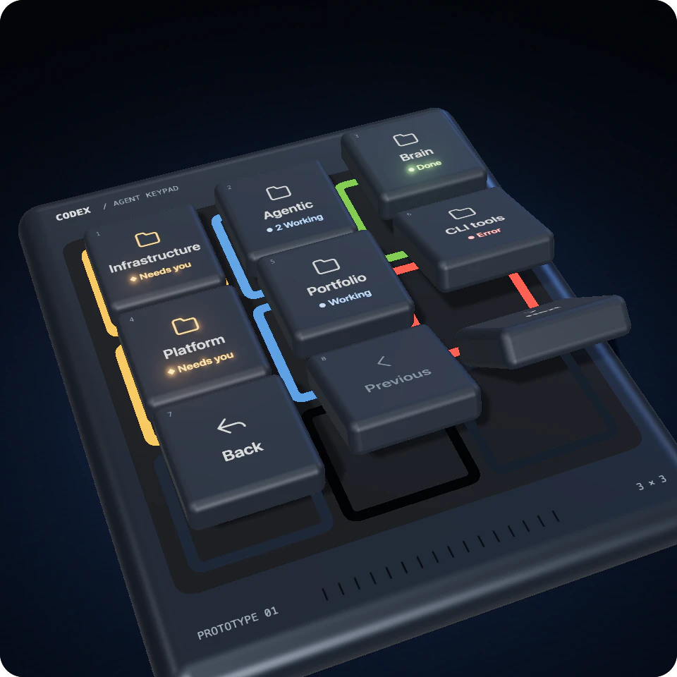
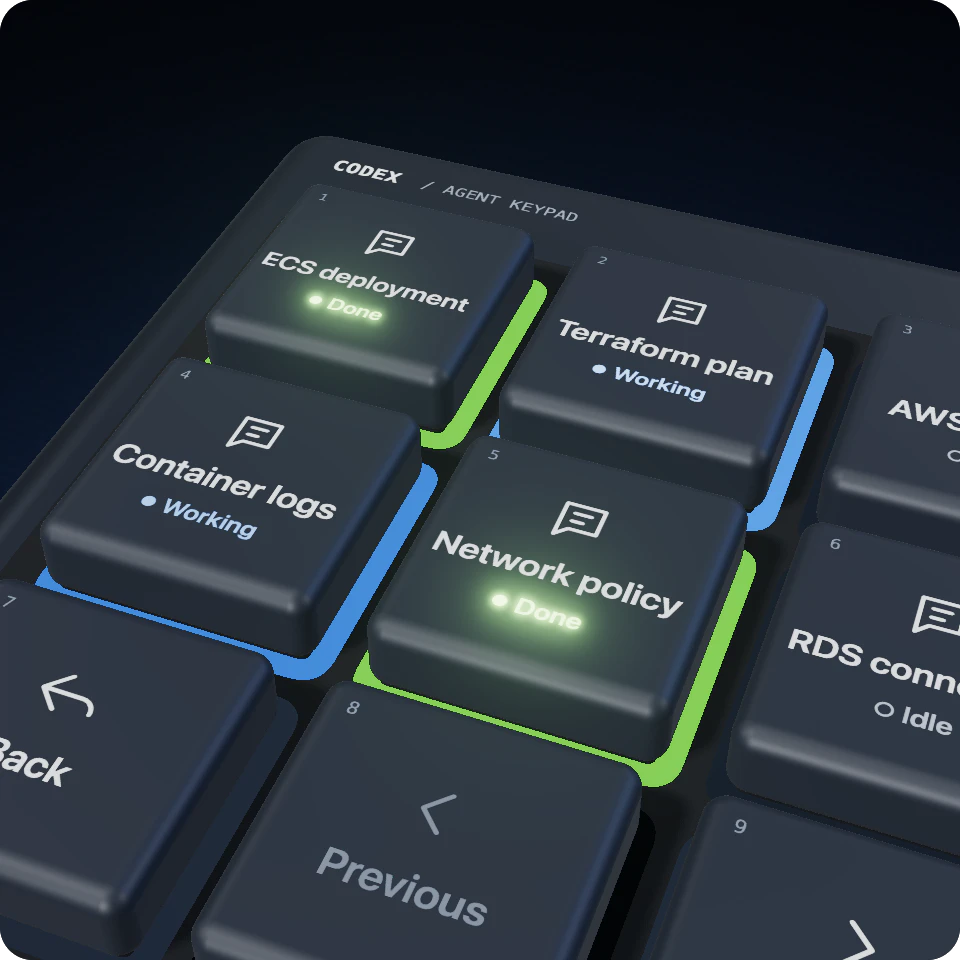
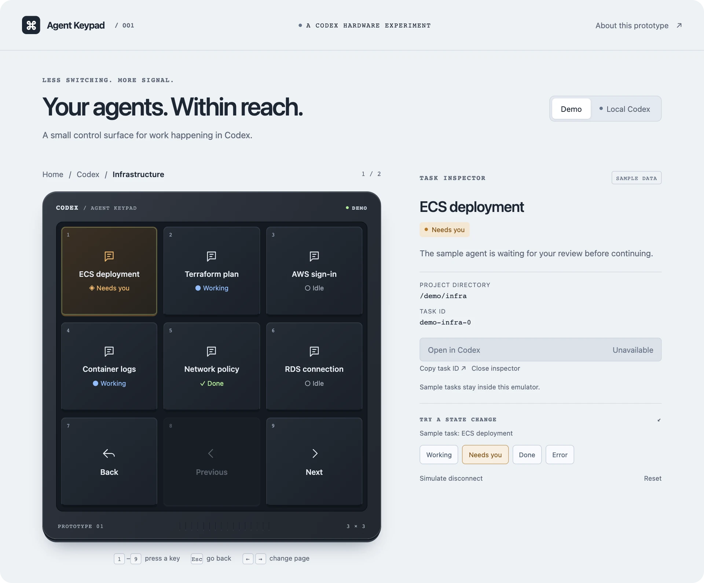
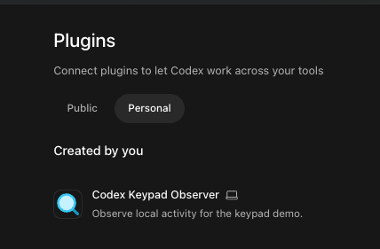

<p align="center">
  
</p>

<h1 align="center">Codex Agent Keypad</h1>

<p align="center">
  <strong>Nine keys for keeping track of your coding agents.</strong><br>
  See which one needs you. Get to it in three presses.
</p>

<p align="center">
  
  
  
</p>

<p align="center">
  <a href="#why-i-built-this">Why</a> ·
  <a href="#how-it-works">How it works</a> ·
  <a href="#try-it">Try it</a> ·
  <a href="#the-codex-plugin">The plugin</a> ·
  <a href="#whats-real-today">What's real today</a> ·
  <a href="docs/TECHNICAL.md">Technical guide</a>
</p>

<br>

## Why I built this

I manage a lot of AI agents at once, often tens of them, spread across different applications. I drive most of them by voice, and I spend too much of the day flicking between windows to find the one that has stopped and is waiting for me.

I wanted a streamlined way to manage them: something I could glance at, and reach for.

Then Logitech's MX keypad came out, with nine keys that are each a tiny screen. That gave me a concrete use case: could I program a plugin that turns it into a control surface for my agents?

This is that experiment, starting with Codex.

> [!NOTE]
> The physical keypad isn't connected yet. What's here is the software side, running as an emulator in your browser. You don't need any hardware to try it.

<br>

## How it works

<table>
  <tr>
    <td width="33%" valign="top">
      
      <h3>1 · Glance</h3>
      <p>Amber means an agent is waiting for you. The colour rolls up, so one key tells you about every task underneath it.</p>
    </td>
    <td width="33%" valign="top">
      
      <h3>2 · Press</h3>
      <p>Follow the colour down: Codex, then the project, then the task. It is never more than three presses away.</p>
    </td>
    <td width="33%" valign="top">
      
      <h3>3 · Act</h3>
      <p>The task's key takes you to that conversation in Codex. Unblock it, the amber clears, and you're back to a quiet keypad.</p>
    </td>
  </tr>
</table>

<p align="center">
  
</p>

The bottom row never changes: **Back**, **Previous**, **Next**. Your hand learns the layout once.

<br>

## Try it

You need Node.js 24.16 or newer. No account, API key, or keypad.

```sh
npm install
npm start
```

Open [localhost:3000](http://localhost:3000) and press **Codex → Infrastructure**. Number keys **1–9** press the keys, **Esc** goes back.

<p align="center">
  
</p>

The demo uses made-up tasks. On a Mac it can also read your own saved Codex tasks; the [technical guide](docs/TECHNICAL.md#four-ways-to-run-it) covers that.

<br>

## The Codex plugin



The keypad hears about your agents through a small Codex plugin I wrote, **Codex Keypad Observer**.

It adds five hooks to Codex. When a task gets a prompt, uses a tool, asks for approval, or stops, the plugin passes a short note to the keypad: which task, what kind of event, and when.

That is all it sends. Prompts, outputs, and transcripts are discarded, and it can't control a task or answer an approval for you.

It's optional. The demo and reading your saved tasks both work without it.

**To install it:**

1. Copy `plugins/codex-keypad-observer` into `~/plugins/`.
2. Add it to your personal plugin marketplace file.
3. Restart Codex, open **Plugins → Personal**, and install it.
4. Review and trust its five hooks.
5. Run `npm run start:events`.

The [full install steps](docs/OBSERVER.md#install-the-plugin) include the marketplace file to copy. macOS only.

<br>

## Built carefully

Reading your real agent data is the risky part, so that is where most of the work went.

- **It can only read.** The part that touches Codex's data runs in a macOS sandbox that blocks every file write and all network access. If the sandbox isn't available, it doesn't run.
- **It doesn't guess.** Anything the keypad hasn't actually seen shows as **Unknown**, and what it has seen expires rather than going stale.
- **The tests try to break it.** They deliberately attempt to overwrite, delete, rename, and corrupt test copies of the data. Every attempt is blocked.
- **Nothing to install.** No dependencies; it runs on plain Node.

The first approach I tried was retired after a metadata-path incident. That is [written up](docs/METADATA-INCIDENT.md) too.

<br>

## What's real today

| | |
|---|---|
| **Working** | The emulator, with navigation, attention roll-up, and sample state changes.<br>Reading your saved Codex projects and tasks on macOS. |
| **Experimental** | Live status from the Codex desktop app (Working, Needs you, Idle, Error).<br>The Codex plugin's activity feed.<br>Opening a task in Codex from its key. |
| **Not yet** | The physical keypad. Logitech hardware is untested and the adapter is a placeholder.<br>Other apps. The Claude, VS Code, Terminal, GitHub, and AWS keys are placeholders. |

The [technical guide](docs/TECHNICAL.md#whats-proven-and-what-isnt) has the full detail on what has been proven and what hasn't.

<br>

## Go deeper

- [Technical guide](docs/TECHNICAL.md): run modes, architecture, and how to verify the safety claims
- [Safety evidence](docs/SAFETY.md)
- [Investigation notes](INVESTIGATION.md)
- [How the banner was made](docs/TECHNICAL.md#the-hero-animation): it's a three.js scene, and the source is in this repo

---

<p align="center"><sub>Independent portfolio experiment; not affiliated with OpenAI or Logitech.</sub></p>
