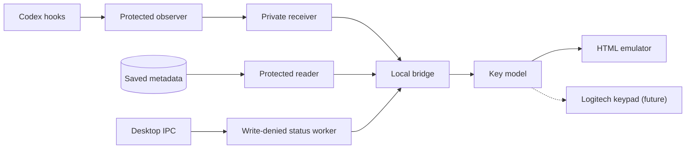

# Technical guide

Everything the [README](../README.md) leaves out: run modes, architecture, how to verify the safety claims, and exactly what has and hasn't been proven.

## Contents

- [Engineering highlights](#engineering-highlights)
- [Four ways to run it](#four-ways-to-run-it)
- [How it fits together](#how-it-fits-together)
- [Verify it yourself](#verify-it-yourself)
- [What's proven, and what isn't](#whats-proven-and-what-isnt)
- [The hero animation](#the-hero-animation)

## Engineering highlights

| | |
|---|---|
| **Read-only by construction** | Real Codex data is read by a child process launched under a fixed macOS sandbox profile that denies all filesystem writes and all network access. If the sandbox is unavailable, the reader does not run. |
| **Defence in depth** | SQLite is opened read-only with a restrictive authorizer, extension loading off, and one bounded `SELECT` whose inputs never come from the browser. |
| **Tests that attack the fixtures** | The suite deliberately attempts writes, deletes, renames, truncation, SQL mutations, and sidecar creation. All are blocked; fixture files stay byte-identical. |
| **Fail closed** | Worker timeouts, missing sidecars, unsupported schemas, and protocol surprises all resolve to **Unknown** rather than a guess or a repair. |
| **Zero dependencies** | Plain HTML/CSS/JavaScript and TypeScript run directly by Node 24.16+. The standalone build is a single 53 KB file. |
| **Written-up evidence** | Every capability has a doc recording what was tested, on what, and what is still unproven, including the [incident](METADATA-INCIDENT.md) that retired the first approach. |

## Four ways to run it

| Command | Data | What you get |
|---|---|---|
| `npm start` | Fictional | The demo. Local-data access stays off. |
| `npm run start:local` | Saved Codex task metadata | Your real projects and tasks, read through the protected reader. |
| `npm run start:desktop` | Metadata + live status checks | **Working**, **Needs you**, **Idle**, or **Error** from Codex's runtime flags. Experimental. |
| `npm run start:events` | Metadata + observer plugin feed | **Activity seen**, **Approval seen**, **Stop seen** from Codex hooks. |

In every mode, open [localhost:3000](http://localhost:3000). **1–9** press keys, **Esc** goes back, and **← / →** change pages.

### Read your saved Codex tasks — `npm run start:local`

On macOS, stop the demo server and run `npm run start:local`.

The local page selects **Local Codex** and connects when the bridge starts. The reader runs under macOS restrictions that deny filesystem writes and network access. It opens the metadata database read-only, never starts Codex, and never edits or repairs task paths. If a refresh fails, the page briefly shows stale data and the bridge retries through the same protected reader. Plain `npm start` keeps local-data access off.

This reads **saved task metadata**, so real task states initially show **Unknown**. Projects, names, saved order, and task assignments refresh automatically every 10 seconds. No manual catalog is needed. Repeated task titles, such as scheduled daily runs, occupy one key by default; **Show every saved run** reveals every distinct task. Nothing is removed from Codex. **All saved folders** keeps unmatched history accessible. The stored order can differ from the desktop sidebar.

### Experimental desktop status — `npm run start:desktop`

The local bridge connects on startup and the browser opens in **Local Codex** mode. On the project keypad, the newest task in each visible project is checked if it changed within the last day; opening a project checks its most recent visible task, and selecting any task checks it on demand. The keypad can show **Working**, **Needs you** (approval or user input), **Idle**, or **Error** from Codex's live runtime flags. Checks run one at a time and expire after 45 seconds; unchecked tasks remain **Unknown**. Counts are labelled **seen**, since this is not an all-task observer.

The status worker can send only initialization and one-task follow/status requests to Codex's private local IPC socket. macOS denies it all filesystem writes. It discards conversation payloads and stops at a 32 MB frame limit. This protocol is undocumented and may change; the demo fails closed to Unknown. It has been tested against a real running desktop task, but approval and input-wait transitions still need live end-to-end validation. See [desktop IPC evidence and limits](DESKTOP-IPC.md).

### Optional activity feed — `npm run start:events`

The companion **codex-keypad-observer** plugin sends small activity observations through a private local socket. Install and review its hooks in Codex before using a new task to try it. Labels say **Activity seen**, **Approval seen**, or **Stop seen**, then expire to Unknown after 30 seconds while retaining the last event for context. They do not claim continuous running status or successful completion. Sanitized observations are cached in this project's ignored `.local/` directory; Codex files are never written. See [setup and evidence](OBSERVER.md).

Run `node server.ts --local-read --events --desktop-status` to combine both feeds.

### Standalone portfolio version — `npm run build`

Open or host **`dist/index.html`**. The single 53 KB file includes the interface and fictional data; no real task information is bundled. Real-data access requires the local bridge.

## How it fits together



Three independent, read-only feeds meet at a local bridge bound to `127.0.0.1`. The bridge serves static files and in-memory results, rejects cross-origin and cross-host requests, and cannot start a reader in its default configuration.

The emulator and the future device share the same key model. In Local Codex mode, a task key uses the [documented `codex://threads/<thread-id>` link](https://learn.chatgpt.com/docs/reference/commands#deep-links) to request its local chat; Demo mode stays inside the emulator.

| Path | Purpose |
|---|---|
| `server.ts` | Local HTTP bridge |
| `packages/domain`, `packages/keypad-model` | Pure state mapping, attention roll-up, and the nine-key layout |
| `packages/codex-client` | Sandboxed metadata reader and desktop status worker |
| `packages/activity` | Observer event receiver and cache |
| `packages/logitech-adapter` | Stub for the future device |
| `plugins/codex-keypad-observer` | Codex plugin that emits hook observations |
| `public/` | The emulator |
| `tests/` | Fixture tests, including the deliberate mutation attempts |
| `docs/` | Safety evidence, investigations, and incident write-ups |

## Verify it yourself

```sh
npm test               # Fixture tests; stop the event bridge first
npm run prove:hooks    # Isolated Codex + mock model; no account; stop bridge first
npm run prove:observer # Shared-runtime experiment; isolated data and local mock model
npm run probe          # Protected metadata read; aggregate counts only
```

Tests deliberately attempt writes, deletes, renames, truncation, SQL mutations, and sidecar creation against fixtures. All are blocked; fixture files remain byte-identical. Read [the safety evidence](SAFETY.md) and [investigation](../INVESTIGATION.md). The initial App Server approach was retired after a [metadata-path incident](METADATA-INCIDENT.md).

## What's proven, and what isn't

| Claim | Status |
|---|---|
| Protected reader leaves Codex data untouched | Proven against fixtures, with destructive probes blocked. [Evidence](SAFETY.md) |
| Hook activity feed | Proven with an isolated Codex runtime; has received real desktop task events after installation. Complete lifecycle coverage remains unverified. [Evidence](OBSERVER.md) |
| Working / approval-wait / input-wait / idle states | Confirmed accurate when clients share one runtime. [Runtime observer proof](RUNTIME-OBSERVER-PROOF.md) |
| Desktop IPC status | Tested against a real running desktop task without starting another Codex server. Approval and input-wait transitions still need live end-to-end validation. Undocumented protocol; not an official plugin API or universal installer. [Evidence](DESKTOP-IPC.md) |
| Opening a task in Codex from a key | Uses the documented deep link. Browser automation blocked the external-app jump, so the click still needs manual verification in the desktop app. |
| Logitech hardware | Unverified. The adapter is a stub. |

## The hero animation

The README banner and the three step images are a three.js scene ([source](hero/scene.js)) of the same nine-key layout, using the demo's fictional tasks. Every frame is a pure function of time, so [`hero/record.mjs`](hero/record.mjs) can step it in headless Chrome and encode a seamless loop. It is a rendering of the concept, not a photo of hardware.

The recorder is the only thing here that needs a package, and it is not saved to `package.json`. It also needs Google Chrome and the `webp` tools (`brew install webp`).

```sh
npm i --no-save playwright-core
node docs/hero/record.mjs          # keypad.webp, the animated banner
node docs/hero/record.mjs --cards  # step-1.webp … step-3.webp
```

To watch the scene live, serve the folder and open it: `python3 -m http.server 8123 --bind 127.0.0.1 -d docs/hero`.

---

Independent portfolio experiment; not affiliated with OpenAI or Logitech.
